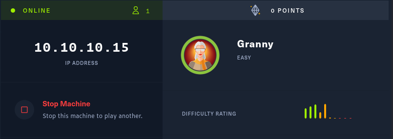
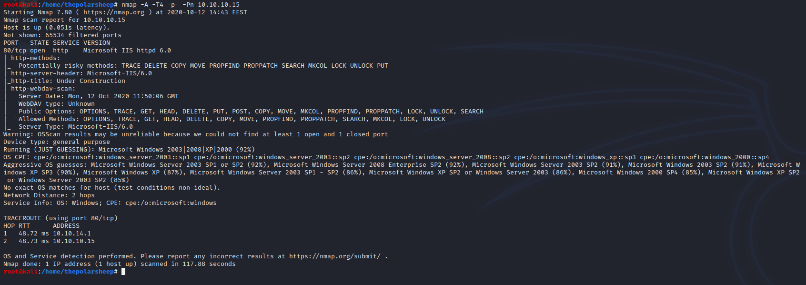
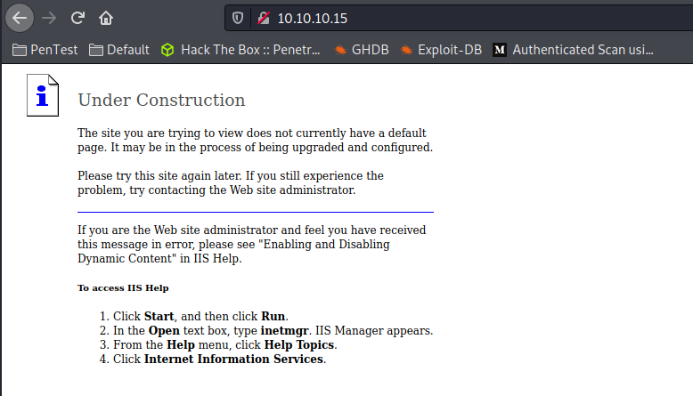
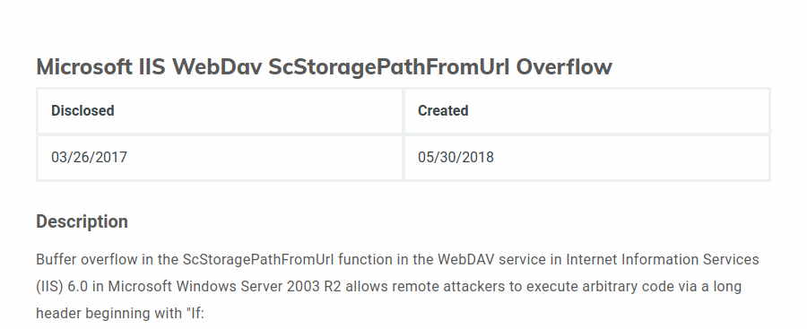
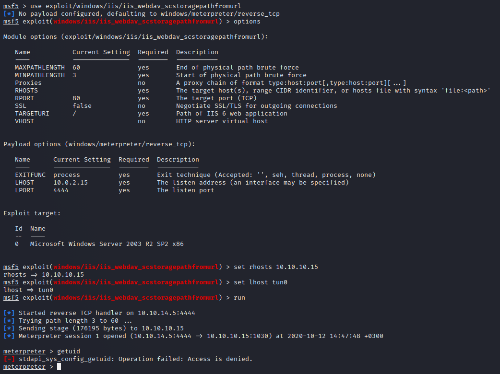
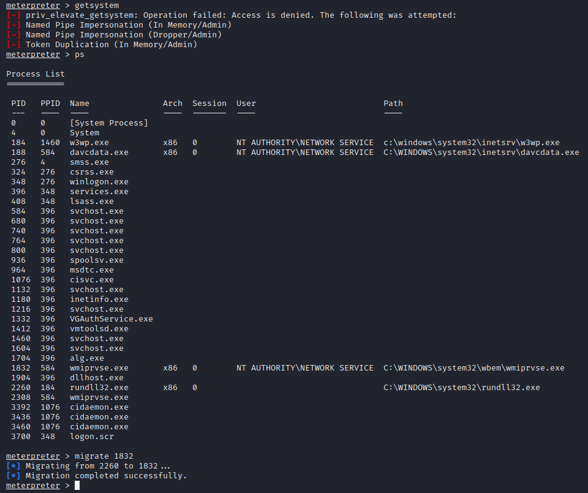
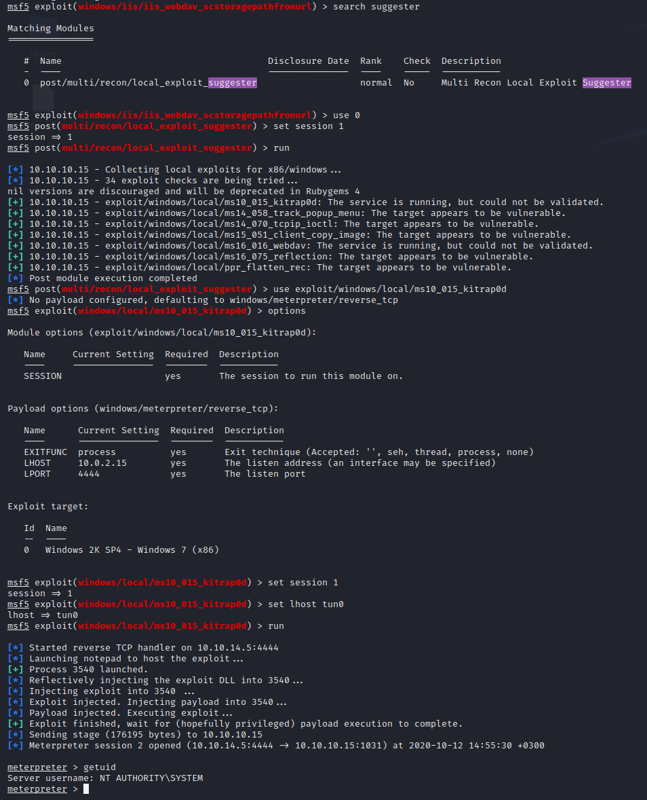

Continuing from last post I will now add a walkthrough for HackTheBox retired machine “Granny”. The machine is like the machine “Grandpa”. At one point of exploitation I had to double check the IP address to make sure I am not hacking again the same Grandpa machine.

### Nmap
After firing up the machine a good place to start is doing a Nmap scan for it. The method I use to scan is something I have found to be good and sufficient. 
`Nmap -A -T4 -p- 10.10.10.15`
* -A is for finding all the services behind the ports
* -T4 as for the amount of threads from scale of 1-5. 
* -p- to scan all the ports
	

### Checking the results
Now that the results are back, we can analyse the findings. Looking at the result there is only a port 80 open with a Microsoft IIS httpd 6.0 server behind it. Therefore, this must be our attack surface. First off, I will just navigate to the address and see what is behind the port 80.

### Finding an Exploit
Seems that there is an unconfigured IIS server with the default index page and from here you cannot really do anything. So, using Google to find some possible exploits for the given IIS server I found this one that seems good. It was listed on rapid7 page and I can see that there is a ready module for this exploit in Metasploit.

### Exploiting
Firing up the Metasploit console and using the `exploit/iis/iis_webdav_scstoragepathfromurl` module to try breaching the web server. After setting up all the options as needed (in this module only the rhosts and lhosts), it is time to fire up the exploit and see what happens.

### Privelage Escalation
Seems that the exploit worked, and we got a meterpreter shell on the server. But when typing the command `getuid`, we see that we do not have admin. I tried to elevate the shell with Metasploit with the command `getsystem` but that failed. So, at this point let us list the processes with the command `ps` and try out the same process migration as with the grandpa machine.

And seems that we could migrate the process to an active one. Now we can just set the session in the background with the “background” command.
Now that the session is in the background and it was given a session number, lets use suggester to find what kind of possible exploits there could be for this machine. Looking at the suggesters we get a bunch of different possible exploits for this session. I decided to go with the `ms10_015_kitrap0d` exploit for this machine

After setting the options for the exploit and running it, entering the `getuid` command we can see that we have an elevated shell for the machine. Now we can fetch the flags.
