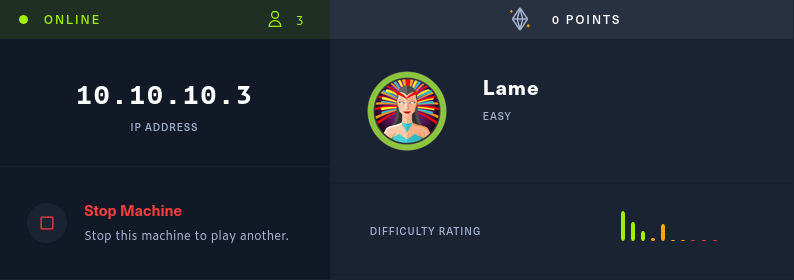
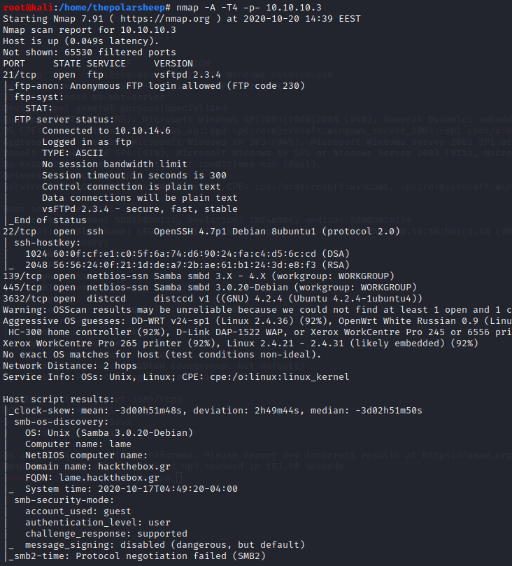
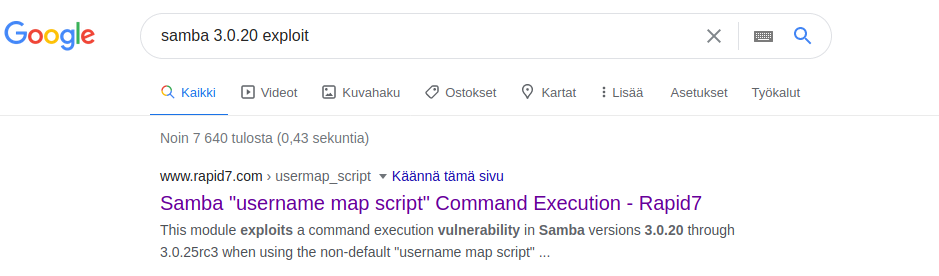
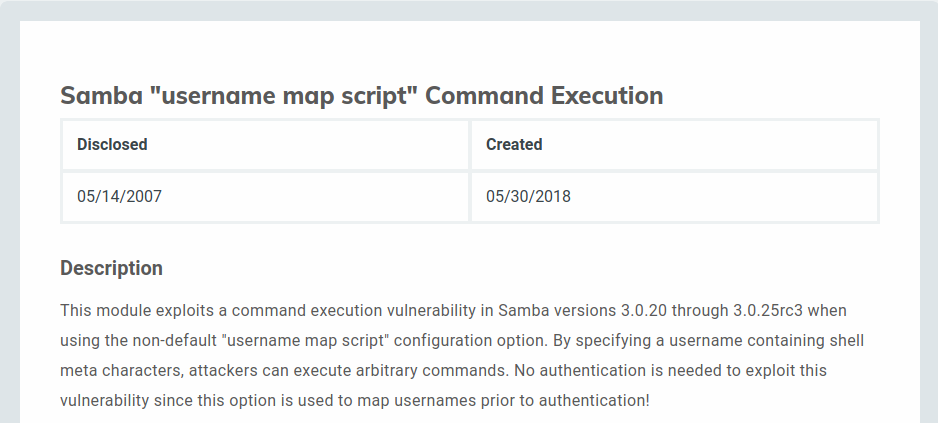
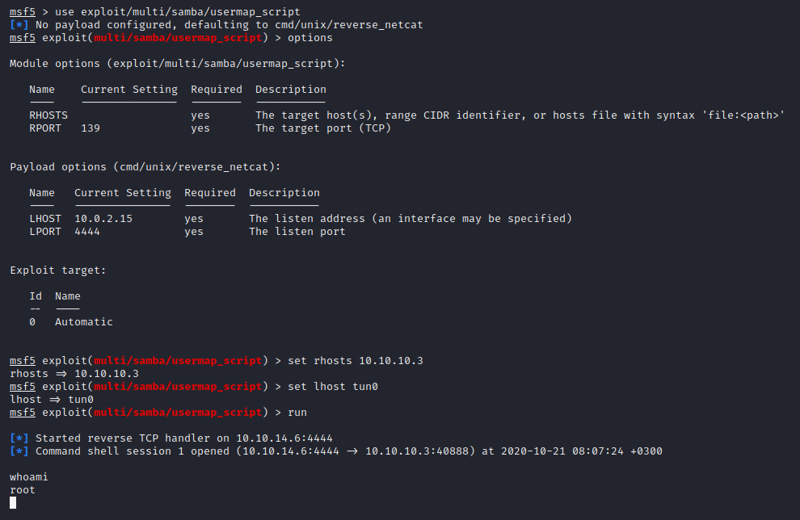

Today I am hacking a machine called “Lame” in HackTheBox. The difficulty of this machine is close to “Trivial” and it serves as a good starting point for hacking.

### Nmap
As always, I start my assessment with a nmap scan in order to learn more about the machine and the possible ports from where to gain access.
`Nmap -A -T4 -p- 10.10.10.4`
* -A is for finding all the services behind the ports
* -T4 as for the amount of threads from scale of 1-5. 
* -p- to scan all the ports
	

### Checking the results
For this machine it took surprisingly long to return the nmap scan, but just to note, the scanning time differs with every machine and instance. I have had in the past a scan that took roughly 20 hours to complete, but that was an instance where I scanned 196 IP addresses.
But now that the scan is back, we have an idea of where we could possibly attack the machine. Looking at the ports, there are a few open. Just note from the start, the version of ftp that is on the machine is actually vulnerable for an exploit but with this machine it does not work. Normally FTP is not a really good path to exploit. Normally FTP hacks would be good if you could insert a file through the FTP and access it from somewhere, like for example a web interface.
The openSSH has also a vulnerability but that will not work with this machine.
Looking at this device we actually have two ways to get inside, in this writeup I will be exploiting a flaw in the smb version 3. The distcc service can be exploited as well, and a meterpreter shell is easily spawned, but it gets a little trickier to escalate from the daemon you land on. 
### Finding an Exploit
Once again we will google for an exploit, this time for Samba version 3

Straight up the first result returns us a page from Rapid7. I always prefer anything that is listed on Rapid7 because often they have a ready made module in Metasploit for the exploit. Checking the Rapid7 page we can confirm this could be our way in.

### Exploiting
Now that we know what exploit to try for this machine, let us open Metasploit and test it out. For this we will use the `exploit/multi/samba/usermap_script` exploit. For this module, we need to only tell the RHOSTS and LHOST information. 

After running the scan and checking `whoami`, we can see that we are root and have full access to the machine. Now we can grab the flags.

