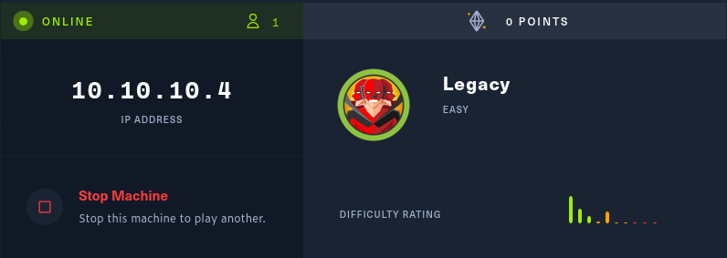
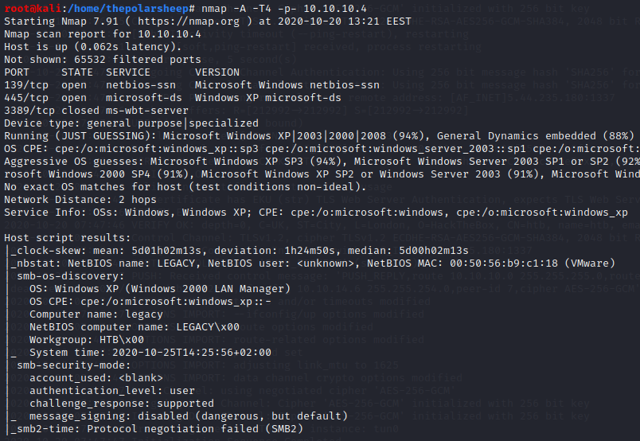
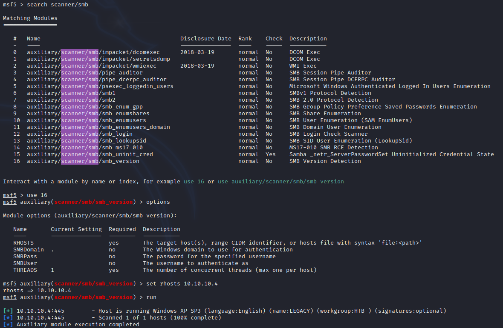
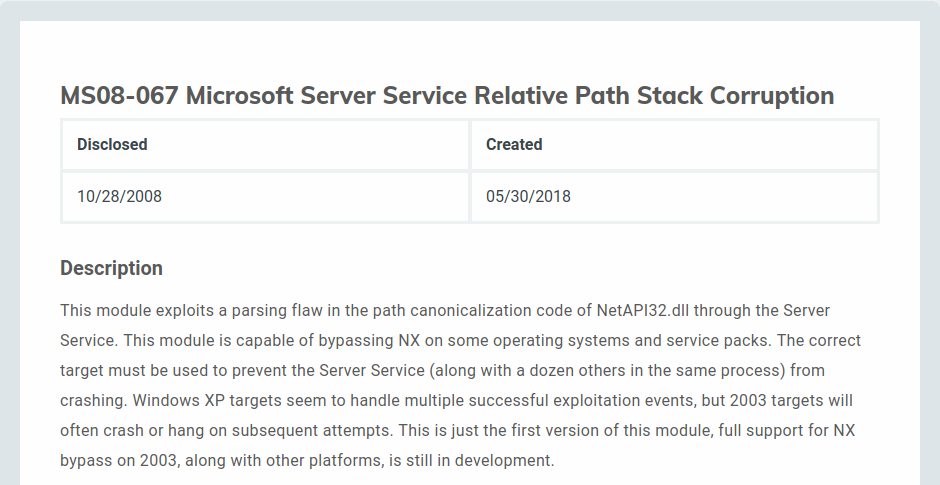
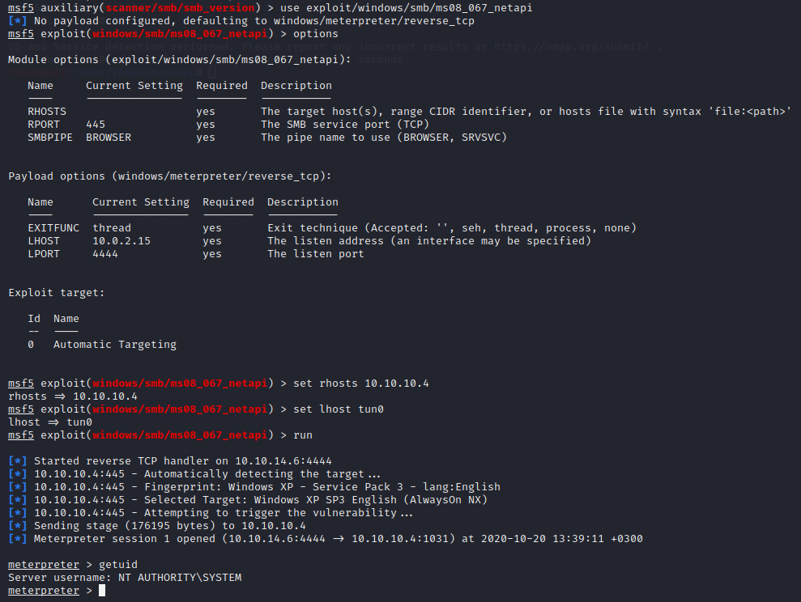

Once again, I am posting another walkthrough. This time for HTB machine called “Legacy”. The machine is easy to exploit and requires very little effort. As for the teaching purpose, it is a good reminder to patch all software and stop using discontinued operating systems.

### Nmap
I am going to start again with a quick nmap scan to see what possible entry points I have for this machine. Again, I will use nmap the way I have learned and found to be good.
`Nmap -A -T4 -p- 10.10.10.4`
* -A is for finding all the services behind the ports
* -T4 as for the amount of threads from scale of 1-5. 
* -p- to scan all the ports
	

### Checking the results
Now that we have completed the scan, we can start to inspect the findings and figure out how to attack the machine. Looking at the results, seems that there are SMB related ports open but not too much of information. To gain more information on the machine I will use metasploits `auxiliary/scanner/smb/smb_version` scanner to gain more information from the machine.

### Finding an Exploit
Looking at the SMB scanners results, we cannot see too much information, but we do know now that it is a Windows XP SP3 machine. Let us see if there is exploits for XP SP3 related to SMB. And while Googling, I found an exploit listed on Rapid7 page that looks promising.

### Exploiting
Now that we know what exploit to try for this machine, let us open Metasploit and test it out. For this module, we need to only tell the RHOSTS and LHOST information. 

Seems that the exploit worked, and we got a meterpreter shell on the server. And trying out the `getuid` command we can see that we have system rights. Now we can grab the flags.

