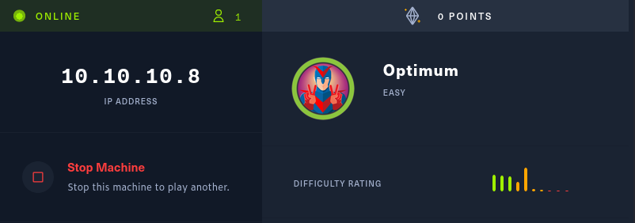
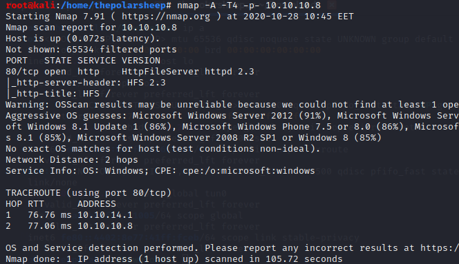
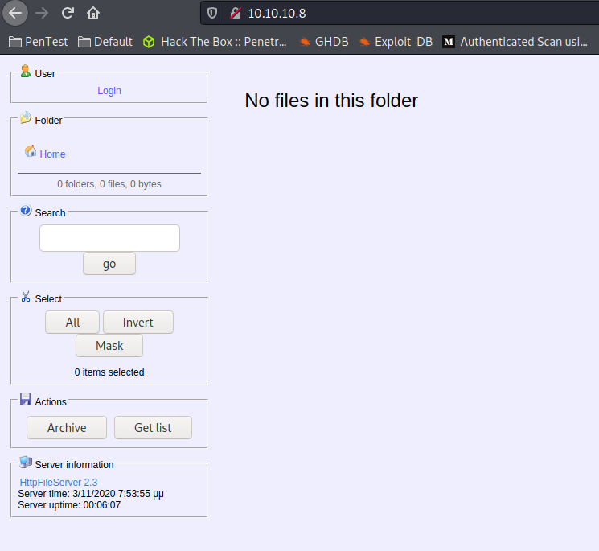
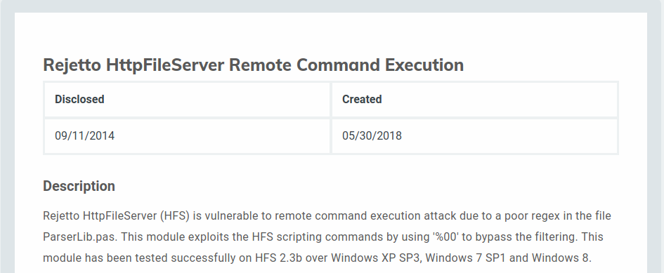
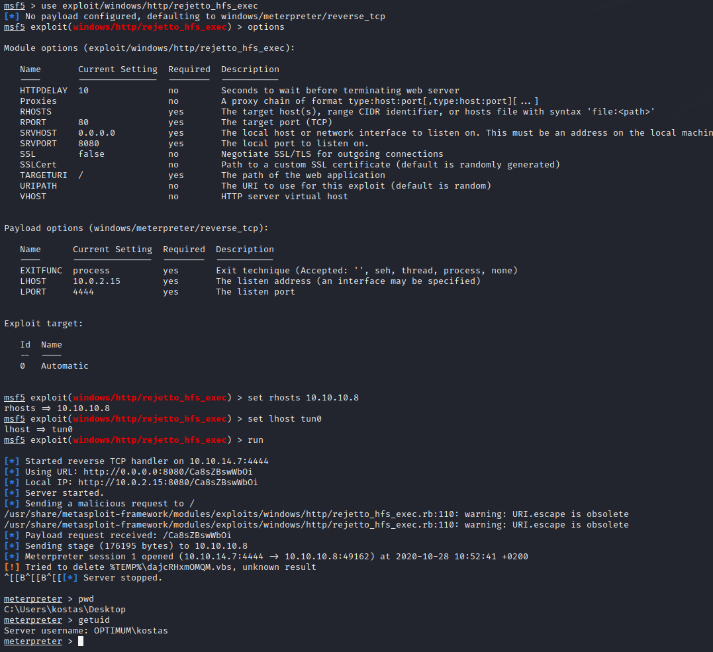
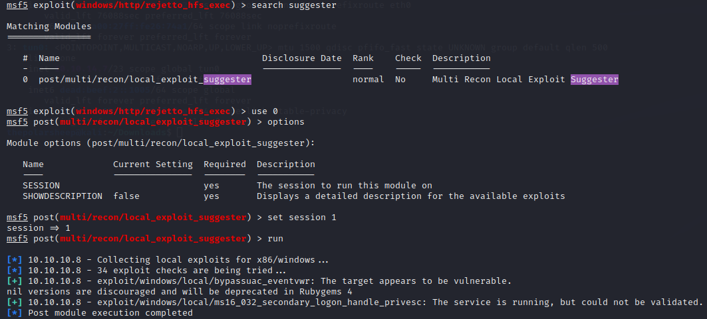
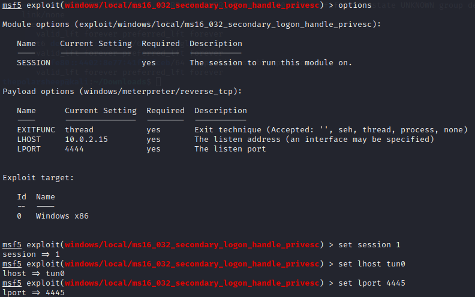
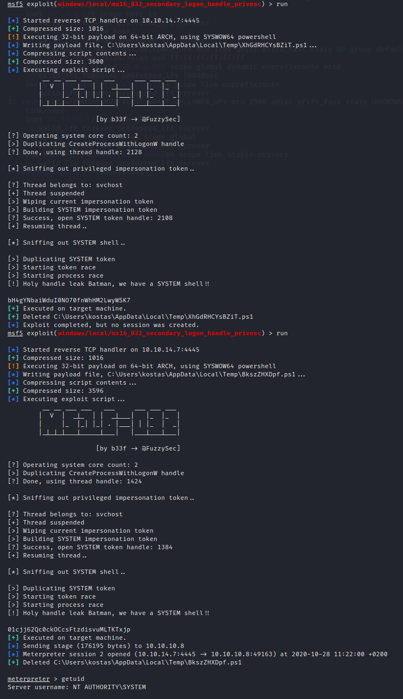

Today I will be hacking a HTB retired machine called “Optimum”. Now for this machine, just as the previous ones and a few to come, this is an easy machine and actually does not require too much of effort to hack.

### Nmap
As always, I start finding my way in with a simple Nmap scan.
`Nmap -A -T4 -p- 10.10.10.8`
* -A is for finding all the services behind the ports
* -T4 as for the amount of threads from scale of 1-5. 
* -p- to scan all the ports
	

### Checking the results
Okay now that the results are in, we can start inspecting what we have found from the scan. With this scan we can see that there is only a port 80 open and therefore there is probably some webpage behind it. Let us check it out.

### Finding an Exploit
Okay now that we know what behind the port 80, there is a few ways to exploit the machine. We could try to upload a malicious file on the server and gain a reverse shell through it, but for now I will google if I can find an exploit for this. And the first one that I found is:

### Exploiting
Now that we know what exploit to try for this machine, let us open Metasploit and test it out. For this module, once again we only need the RHOSTS and LHOST information.  

Seems that the exploit worked and we a got a shell but running the `getuid` command we can see that we couldn’t get system shell on the machine. So for now lets set this session in the background and use the suggester tool from Metasploit. 

Seems that we got a few possible hits on what to use for this session. But for now we will go with the `windows/local/ms16_032_secondary_logon_handle_privesc` and let’s see what happens. For this module just insert the session number and LHOST and then you are good to go.

Now lets run it and see can we get a system shell on the machine!

Seems that there was a problem the first time running the module but on the second run it worked, and we can confirm we have a system shell. This is something to keep in mind when trying to exploit machines. If you think that the exploit should work, you can always run it again. It might often happen that it needs a few tries before it works :) 
