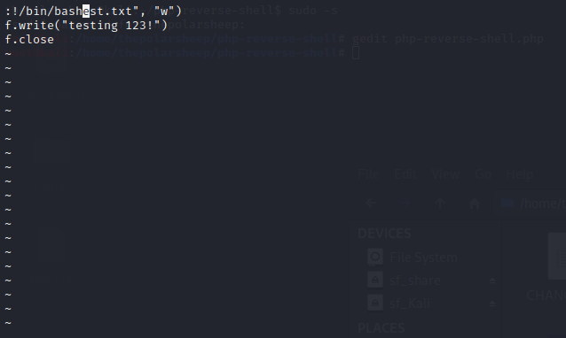

This time I will be hacking a HTB retired machine called “Bashed”. This on is said to be easy but it requires a lot more effort to hack.

### Recon
As always, I start finding my way in with a simple Nmap scan.
`Nmap -A -T4 -p- 10.10.10.68`
* -A is for finding all the services behind the ports
* -T4 as for the amount of threads from scale of 1-5. 
* -p- to scan all the ports
	

### Checking the results
Okay so looking at the results we can see that there is a port 80 open. So as before, let’s go check what is behind the port 80.

This seems to be some sort of blog page that is mainly focusing on some phpbash script, but there’s not much in addition to that. So let’s try Dirbuster to check if there are any hidden pages or files on the server. 

Looking at the results from dirbuster, we can see something interesting. Theres a .php file with the phpbash name, the same as what the webpage is promoting on the front page. Let’s go check it out.

### Gaining access
Seems that this phpbash.php file is some sort of web shell. Trying the shell out for a while I discovered it does not have all functions as what a normal shell does and I cannot elevate the user with it, but I surely can use it to gain access to the machine. I did find out that there is a user named scriptmanager but was unable to change for that either. 

To gain a shell on the device I have to upload some sort of reverse shell file on the page and try to load it. I have found pentestmonkeys reverse shell cheatsheet really useful with many devices (http://pentestmonkey.net/cheat-sheet/shells/reverse-shell-cheat-sheet) and was happy to find a ready made php reverse shell from the same author. I decided to test it out.

It was fairly simple to use, first download the reverse shell script to your device. Then edit the script to have your IP listed as shown in the picture. Next we need to get the reverse shell on the server so I’ll just create a quick web server using python, and then we can download the file to the machine through the web shell that we have.

### Reverse Shell
Now that we have uploaded the reverse shell script on the machine, we can start our Metasploit handler to receive the shell. 

Now that the handler is in place we can go and access the script from the webpage and hopefully gain a reverse shell to our console. 

And it seems the reverse shell worked. We got a shell! But unfortunately we logged in as www-data and have no tty stil so I will try to use a simple python script found from here (https://netsec.ws/?p=337) to get a working tty on the machine. 

Now I can actually try to get elevated access on the machine. First I will list all the files available to run as sudo with the command `sudo -l` and it seems that there is one file for scriptmanager that can be run as root. Let’s try to change user to scriptmanager.

### PrivEsc
Now that we can access the file we actually have at least two ways for Privilege Escalation. We can either edit the script that runs with root privileges or we can use a simple VI trick. In this writeup I will leverage the VI text editing software to get a elevated shell. The trick is fairly simple, first I open a new shell tab on my machine with netcat listening. Then since this file can be run as root, I just open the file with VI editor, and then exit it with command `:!bin/bash`. Now to check the netcat listener, we can see we have root access to the machine and can get the flags.

### Bonus

As said before, the machine can be owned also with changing the available script with something malicious. Here is a screencap for the script.

