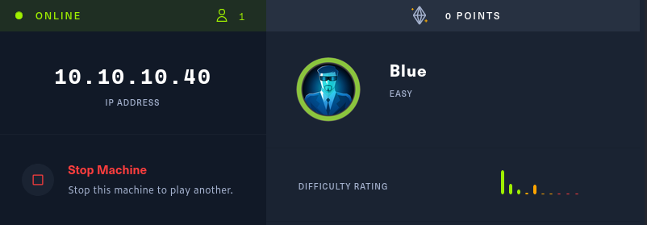
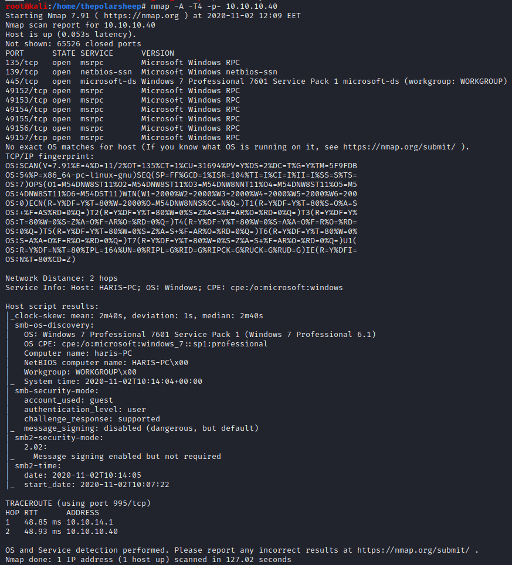
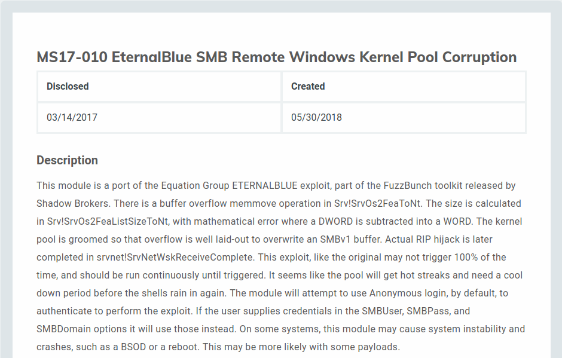

Okay today I’m posting about HTB machine “Blue”. This machine is really fast to exploit and should not require too much of effort to gain the flags!

### Recon
Once again lets start with a quick nmap scan to see what ports and services we have on our target. 
`nmap -A -T4 -p- 10.10.10.40`
	

### Exploit
Looking at the results of the scan we can see the machine has windows 7 running and seems to have smb enabled. I can recall already at this point a past exploit with the name EternalBlue. This was a devastating exploit that targeted windows machines with smb enabled. And taking in consideration the name of the machine is “Blue”, I have a hunch it EternalBlue works for this machine. And to explain myself a little, in HTB the machines often have a name that is relevant to the exploit. Let’s Google a little to see if Metasploit would have a ready module for EternalBlue.

Seems that it indeed does have a module for it so now lets try to run it.

And as suspected, it worked just fine. Now we can grab the flags.

